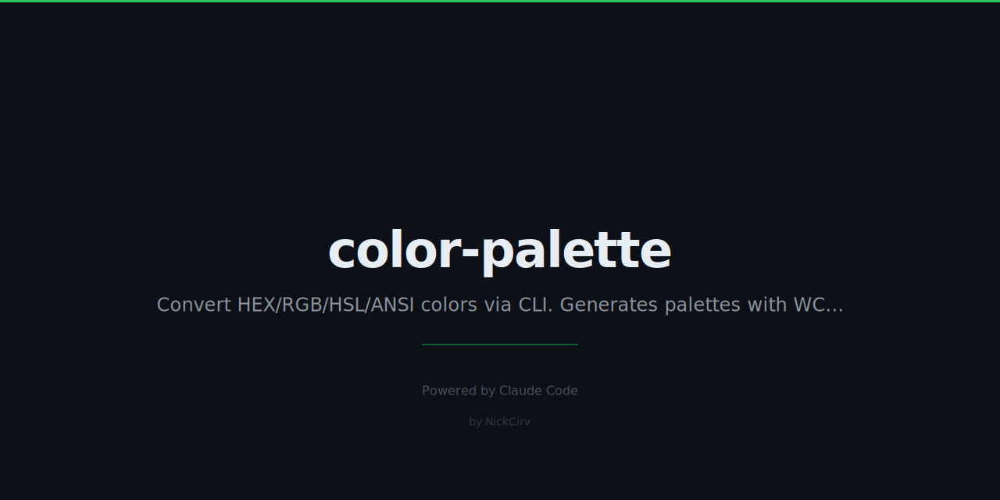

# color-palette

Terminal color tool — convert HEX/RGB/HSL/ANSI, generate palettes, WCAG contrast checker. Zero dependencies.

```
$ color-palette "#FF6B6B"

  ████████████████████
  HEX      #FF6B6B
  RGB      rgb(255, 107, 107)
  HSL      hsl(0, 100%, 71%)
  HSV      hsv(0, 58%, 100%)
  ANSI256  210
  ANSI16   12
```

## Features

- Convert between HEX, RGB, HSL, HSV, ANSI 256, and ANSI 16 color formats
- Terminal color preview using 24-bit true color ANSI codes
- Mix two colors with configurable gradient steps
- Generate color schemes: analogous, complementary, triadic, tetradic, monochromatic
- Lighten, darken, saturate, desaturate any color
- WCAG contrast ratio checker (AA/AAA pass/fail for normal and large text)
- Full 256-color ANSI chart + standard 16-color chart
- Nearest ANSI 256 color finder
- Zero external npm dependencies — built-in Node.js modules only

## Install

```bash
npm install -g color-palette
```

Or use without installing:

```bash
npx color-palette "#FF6B6B"
```

Both `color-palette` and the shorter alias `cpal` are available after install.

## Usage

### Single color — show all formats

```bash
color-palette "#FF6B6B"
color-palette "rgb(255,107,107)"
color-palette "hsl(0,100%,71%)"
color-palette --ansi 196
```

### Mix two colors

```bash
color-palette mix "#FF6B6B" "#4ECDC4" --steps 7
```

### Generate color scheme

```bash
color-palette palette "#FF6B6B" --scheme analogous
color-palette palette "#FF6B6B" --scheme complementary
color-palette palette "#FF6B6B" --scheme triadic --count 3
color-palette palette "#FF6B6B" --scheme tetradic
color-palette palette "#FF6B6B" --scheme monochromatic --count 8
```

### Adjust a color

```bash
color-palette lighten "#FF6B6B" --amount 20
color-palette darken "#FF6B6B" --amount 20
color-palette saturate "#FF6B6B" --amount 15
color-palette desaturate "#FF6B6B" --amount 30
```

### WCAG contrast checker

```bash
color-palette contrast "#FF6B6B" "#FFFFFF"
color-palette contrast "#1a1a2e" "#e94560"
```

### ANSI color charts

```bash
color-palette ansi-chart    # Full 256-color chart
color-palette ansi-16       # Standard 16 ANSI colors with codes
```

### Find nearest ANSI color

```bash
color-palette nearest "#FF6B6B"
```

### Random color

```bash
color-palette random
```

## Input Formats

| Format | Example |
|--------|---------|
| HEX (with `#`) | `"#FF6B6B"` |
| HEX (without `#`) | `"FF6B6B"` |
| RGB | `"rgb(255,107,107)"` |
| HSL | `"hsl(0,100%,71%)"` |
| ANSI 256 | `--ansi 196` |

## Commands

| Command | Description |
|---------|-------------|
| `<color>` | Show all formats + terminal preview |
| `--ansi <n>` | Show ANSI 256 color info (0–255) |
| `mix <c1> <c2> [--steps N]` | Gradient between two colors |
| `palette <color> --scheme <name> [--count N]` | Generate color scheme |
| `lighten <color> [--amount N]` | Lighten by N% (default 10) |
| `darken <color> [--amount N]` | Darken by N% (default 10) |
| `saturate <color> [--amount N]` | Increase saturation by N% |
| `desaturate <color> [--amount N]` | Decrease saturation by N% |
| `contrast <c1> <c2>` | WCAG contrast ratio + AA/AAA results |
| `random` | Generate a random color |
| `ansi-chart` | Full 256-color ANSI chart |
| `ansi-16` | Standard 16 ANSI colors |
| `nearest <color>` | Find nearest ANSI 256 color |

## Schemes

| Scheme | Description |
|--------|-------------|
| `analogous` | Colors adjacent on the hue wheel |
| `complementary` | Opposite colors on the hue wheel |
| `triadic` | Three evenly spaced hues |
| `tetradic` | Four evenly spaced hues |
| `monochromatic` | Same hue, varying lightness |

## Requirements

- Node.js >= 18
- A terminal with 24-bit true color support (most modern terminals)

## Zero Dependencies

All color math is implemented in pure JavaScript using only built-in Node.js modules (`process`). No `chalk`, no `color`, no `tinycolor2` — nothing.

Conversion algorithms:
- **HEX ↔ RGB**: String parsing + bit manipulation
- **RGB ↔ HSL**: Standard IEC 61966 formulas
- **RGB ↔ HSV**: Standard formulas
- **RGB → ANSI 256**: 6×6×6 color cube + 24-step grayscale ramp
- **WCAG contrast**: Relative luminance per WCAG 2.1 spec

## License

MIT
